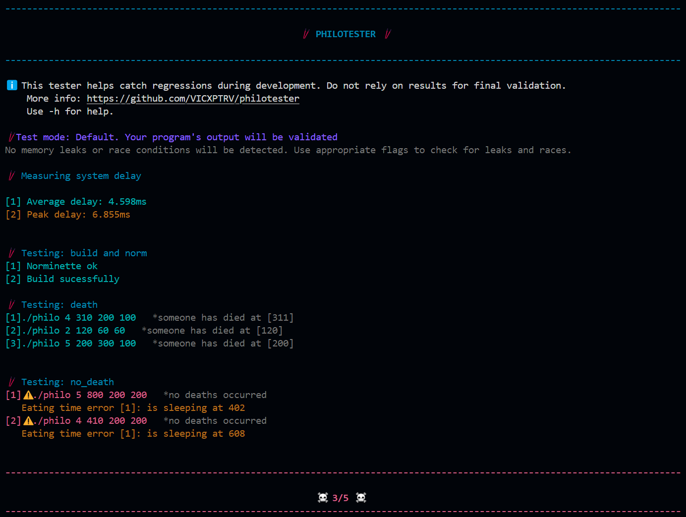

# Philotester 🥢

A testing suite for the Dining Philosophers project

> [!WARNING]
> This may be buggy. Do not fully trust the results. Always check the logs for verification.

## Features

- **Norminette**: Ensures code adheres to coding standards
- **Compilation**: Builds the project before testing
- **Memory Leaks**: Detects leaks using Valgrind
- **Race Conditions**: Detects issues with Helgrind and TSAN
- **Test Cases**: Predefined scenarios in the `cases/` directory
- **Performance**: Measures system performance

## Installation

1. Clone the tester:
```bash
git clone git@github.com:VICXPTRV/philotester.git
cd philotester
```

2. Configure the tester:
   - Open the `config` file
   - Update `EXEC_PATH` to point to your philo project
   - Optionally update other variables

## Usage

```bash
./philotester [options] [cases...]
```
**Options**
- `-m`    Run with valgrind memcheck
- `-h`    Run with valgrind helgrind
- `-s`    Run with thread sanitizer
- `-p`    Prompt manual input
- `-H`    Display help message
- `-d`	  Debug tester itself



## Adding New Test Cases

All test cases are stored in the `cases/` directory.
You can change existing case or add new one

**Test case format**:
```text
number_of_philosophers time_to_die time_to_eat time_to_sleep meal_count
```

**Example**:
```text
3 400 200 200 2
1 400 200 200
```

## Logs

- All logs are in `logs/` directory
- Automatic cleanup between runs
